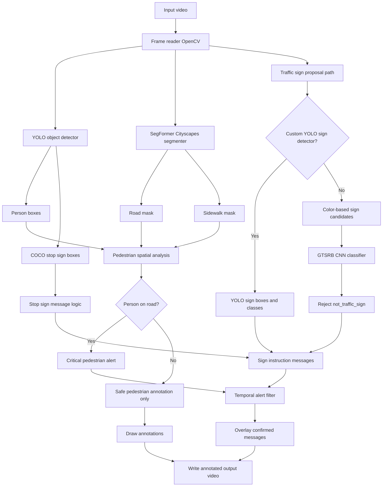

# Road Traffic Sign and Pedestrian Video Assistant

This project detects pedestrians and road traffic signs in driving video, annotates the video, and displays driver-facing instructions such as speed-limit guidance, stop-sign warnings, and pedestrian danger alerts.

The system exists in two runnable forms:

- `Road_Traffic_Sign_and_Pedestrian_Video_Assistant.ipynb`: Kaggle notebook version.
- `road_assistant.py`: standalone local command-line version.

The main safety rule for pedestrians is context-aware: a detected person only triggers a warning when their lower body overlaps the segmented road area more than the sidewalk area. Pedestrians safely on the sidewalk are annotated but do not trigger the critical alert panel.

## Architecture



## Model Components

### YOLO Detector

YOLO is used for real-time object detection. In the default setup, `yolov8n.pt` detects:

- `person`
- `stop sign`

The code deliberately ignores most COCO classes such as cars, buses, windows, and traffic lights because the target output is only humans and traffic signs.

You can also provide a custom traffic-sign YOLO model with:

```bash
--custom-sign-weights /path/to/best.pt
```

This is the best way to annotate all street signs, because a detector learns where signs are in full road scenes.

### SegFormer Cityscapes Segmenter

The segmentation model is:

```text
nvidia/segformer-b0-finetuned-cityscapes-1024-1024
```

It produces pixel-level semantic classes. The code extracts:

- `road`
- `sidewalk`

These masks are used to decide whether a pedestrian is in a risky position. The lower part of the pedestrian bounding box is treated as the foot/base region. If the base overlaps road pixels more than sidewalk pixels, the system can trigger a pedestrian warning.

### GTSRB CNN Sign Classifier

The project includes a small CNN trained on GTSRB. GTSRB is a traffic-sign classification dataset, so it classifies cropped sign images into classes such as:

- speed limits
- yield
- stop
- no entry
- general danger
- animal crossing
- pedestrian crossing
- road work

The improved classifier adds class `43`:

```text
not_traffic_sign
```

This class is trained from random Cityscapes crops so the classifier can reject windows, car lights, advertisements, and other non-sign objects.

Important limitation: GTSRB alone is not a full traffic-sign detector. If the color-based proposal stage does not crop a real sign correctly, the classifier cannot classify it.

## Runtime Pipeline

1. Open the input video with OpenCV.
2. Read one frame at a time.
3. Run YOLO to detect pedestrians and stop signs.
4. Run SegFormer to obtain road and sidewalk masks.
5. For each pedestrian, compare the base of the box with road and sidewalk masks.
6. If the pedestrian is on the road, create a critical alert.
7. Detect signs using either a custom YOLO sign detector or color-based proposals plus the GTSRB classifier.
8. Convert detected sign labels into driver instructions.
9. Apply a temporal filter so alerts must be present for several frames before showing.
10. Draw boxes, labels, and warning messages.
11. Write the annotated output video.

## Function and Class Reference

### Constants

`GTSRB_LABELS`

Maps numeric GTSRB class IDs to readable sign names. Class `43` is `not_traffic_sign`.

`NON_SIGN_LABELS`

Labels that are explicitly ignored in the custom sign detector path. This prevents cars, vehicles, windows, traffic lights, and other non-sign objects from being annotated as signs.

`SIGN_TF`

Image transform used before sign classification. It resizes crops to `64x64`, converts them to tensors, and normalizes them.

### Utility Functions

`device_name()`

Returns `cuda` if a GPU is available, otherwise `cpu`.

`first_match(root, patterns)`

Searches a folder recursively and returns the first file matching one of the requested patterns.

`message_for_sign(label, urgency="normal")`

Converts a sign label into a human-readable driving instruction. For example:

- `speed_limit_50` becomes `Speed limit is 50 km/h. Please adjust your speed.`
- `stop` becomes `Stop sign ahead. Prepare to halt.`
- `animal_crossing` becomes `Animal crossing zone. Watch the road edges.`

`is_probable_sign_label(label)`

Rejects labels that are clearly not traffic signs, such as `car`, `bus`, `window`, `advertisement`, and `traffic light`.

### Dataset Classes

`GTSRBDataset`

Loads GTSRB images and labels. It supports common layouts:

- `Train.csv` with `Path` and `ClassId` columns
- folders such as `Train/0`, `Train/1`, etc.

During training it applies augmentation:

- random crop
- color jitter
- small rotation

During validation and inference it uses deterministic resizing and normalization.

`NegativeCropDataset`

Builds the `not_traffic_sign` class. It randomly samples crops from Cityscapes images. These random background crops teach the classifier to reject non-sign objects.

### Sign Classifier

`SmallGTSRBCNN`

A compact convolutional neural network for sign classification.

Architecture:

1. Conv2D `3 -> 32`, batch normalization, ReLU, max pooling.
2. Conv2D `32 -> 64`, batch normalization, ReLU, max pooling.
3. Conv2D `64 -> 128`, batch normalization, ReLU, max pooling.
4. Conv2D `128 -> 256`, batch normalization, ReLU.
5. Adaptive average pooling to one spatial cell.
6. Flatten.
7. Dropout.
8. Linear classifier to `44` classes.

`make_classifier_loaders(gtsrb_root, cityscapes_root, ...)`

Creates training and validation loaders by combining:

- GTSRB sign images
- Cityscapes negative crops

It also creates a deterministic validation split.

`evaluate_classifier(model, loader, device)`

Computes validation accuracy and separate accuracy for the negative `not_traffic_sign` class.

`train_gtsrb_classifier(...)`

Trains the classifier with AdamW, cosine learning-rate scheduling, mixed precision on CUDA, and best-checkpoint saving.

The checkpoint contains:

- model weights
- number of classes
- label map

`load_gtsrb_classifier(path)`

Loads either the new `44`-class checkpoint or an older `43`-class checkpoint.

### Segmentation

`RoadSegmenter`

Wraps the Hugging Face SegFormer model. It loads the Cityscapes-trained semantic segmentation model and identifies class IDs for `road` and `sidewalk`.

`RoadSegmenter.predict_masks(frame_bgr)`

Runs segmentation on one frame and returns:

- `road_mask`
- `sidewalk_mask`

Both masks are boolean arrays aligned to the original video frame.

### Pedestrian Context Logic

`driving_corridor_bounds(y, h, w, ...)`

Computes a trapezoid-like driving corridor. The corridor is narrow near the horizon and wider near the bottom of the frame.

`is_pedestrian_dangerous(box, road_mask, sidewalk_mask, frame_shape, args)`

Determines whether a pedestrian should trigger an alert.

It checks:

- minimum pedestrian box height
- road overlap under the pedestrian base
- sidewalk overlap under the pedestrian base
- optional driving-corridor filtering

It returns:

- whether the pedestrian is dangerous
- road overlap score
- sidewalk overlap score

### Traffic Sign Proposal and Classification

`sign_candidates_by_color(frame_bgr, args)`

Finds possible traffic-sign boxes using HSV color masks for red, blue, and yellow. It filters candidates by:

- minimum area
- maximum area
- aspect ratio
- fill ratio
- vertical position

This is only a fallback. A custom YOLO traffic-sign detector is more reliable.

`classify_sign_crop(frame_bgr, box, classifier, args)`

Crops a candidate region, preprocesses it, and runs the GTSRB classifier. It uses:

- minimum probability
- top-1 vs top-2 probability margin
- `not_traffic_sign` rejection

If the crop is accepted, it returns the sign label, confidence, and margin.

### Alert Filtering

`AlertFilter`

Prevents flickering alerts. A message is only confirmed after it appears for `alert_confirm_frames` consecutive processed frames.

`AlertFilter.update(events)`

Receives current-frame events and returns only confirmed events.

### Main Inference Class

`DriverAssistant`

Coordinates all models and frame-level logic.

`DriverAssistant.draw_box(frame, box, label, color)`

Draws a bounding box and text label.

`DriverAssistant.overlay_messages(frame, messages)`

Draws the top warning panel with confirmed driver instructions.

`DriverAssistant.detect_people_and_stop_signs(frame, road_mask, sidewalk_mask)`

Runs YOLO detections. It handles:

- pedestrians
- stop signs

For pedestrians, it calls the road-vs-sidewalk danger logic. For stop signs, it creates the proper stop instruction.

`DriverAssistant.detect_custom_signs(frame)`

Detects signs using one of two paths:

- custom YOLO sign detector if `--custom-sign-weights` is provided
- color proposals plus GTSRB classifier if `--use-color-sign-proposals` is enabled

`DriverAssistant.process_frame(frame)`

Runs the full per-frame pipeline:

1. segment road and sidewalk
2. detect pedestrians and stop signs
3. detect other signs
4. filter alerts temporally
5. draw annotations and messages

### Video and CLI Functions

`safe_output_path(video_path, output_path)`

Prevents accidentally overwriting the input video and creates the output directory.

`process_video(args, sign_classifier)`

Reads the video, processes frames, writes the annotated video, and prints progress.

`parse_args()`

Defines all command-line arguments.

`main()`

Loads or trains the classifier, then runs video processing.

## Local Usage

Install dependencies:

```bash
pip install ultralytics transformers accelerate torch torchvision opencv-python pillow numpy
```

Run inference with pedestrian detection and stop-sign detection:

```bash
python3 road_assistant.py \
  --video /path/to/video.mp4 \
  --output annotated_output.mp4 \
  --classifier-path gtsrb_classifier.pt
```

Run inference with GTSRB color-sign fallback:

```bash
python3 road_assistant.py \
  --video /path/to/video.mp4 \
  --output annotated_output.mp4 \
  --classifier-path gtsrb_classifier.pt \
  --use-color-sign-proposals
```

Debug sign proposals:

```bash
python3 road_assistant.py \
  --video /path/to/video.mp4 \
  --output annotated_output.mp4 \
  --classifier-path gtsrb_classifier.pt \
  --use-color-sign-proposals \
  --debug-sign-proposals
```

Train the improved GTSRB classifier:

```bash
python3 road_assistant.py \
  --video /path/to/video.mp4 \
  --output annotated_output.mp4 \
  --gtsrb-root /path/to/gtsrb-german-traffic-sign \
  --cityscapes-root /path/to/cityscapes_data \
  --classifier-path gtsrb_classifier.pt \
  --train-classifier \
  --epochs 20 \
  --negative-count 12000
```

Use a custom YOLO sign detector:

```bash
python3 road_assistant.py \
  --video /path/to/video.mp4 \
  --output annotated_output.mp4 \
  --custom-sign-weights /path/to/best.pt
```

## Kaggle Dataset Paths Used

Example paths from the Kaggle setup:

```text
/kaggle/input/datasets/arjitdsce/cityscapes/cityscapes_data
/kaggle/input/datasets/meowmeowmeowmeowmeow/gtsrb-german-traffic-sign
/kaggle/input/datasets/alopixalopix/sample-video/busa-traffic.mp4
```

## Tuning Guide

If real signs are not captured:

```text
Lower SIGN_ANNOTATION_MIN_PROB
Lower SIGN_ANNOTATION_MIN_MARGIN
Enable DEBUG_SIGN_PROPOSALS
Lower SIGN_PROPOSAL_MIN_AREA_RATIO
```

If too many non-sign objects are captured:

```text
Raise SIGN_ANNOTATION_MIN_PROB
Raise SIGN_ANNOTATION_MIN_MARGIN
Train with more negative crops
Use a custom YOLO traffic-sign detector
```

If pedestrian warnings are too sensitive:

```text
Raise ROAD_OVERLAP_THRESHOLD
Raise SIDEWALK_OVERLAP_SAFE_THRESHOLD
Enable PED_ALERT_REQUIRE_DRIVING_CORRIDOR
```

If pedestrian warnings are missed:

```text
Lower ROAD_OVERLAP_THRESHOLD
Lower MIN_PERSON_HEIGHT_RATIO
Disable PED_ALERT_REQUIRE_DRIVING_CORRIDOR
```

## Important Limitations

This project is a research and education prototype. It is not a safety-certified driver assistance system.

The GTSRB classifier is useful for sign classification, but it is not a complete sign detector. For reliable annotation of all road signs, train or provide a YOLO traffic-sign detector on full driving scenes with bounding boxes.

The pedestrian danger logic depends on segmentation quality. If the segmentation model mislabels road or sidewalk pixels, pedestrian alerts may be incorrect.

