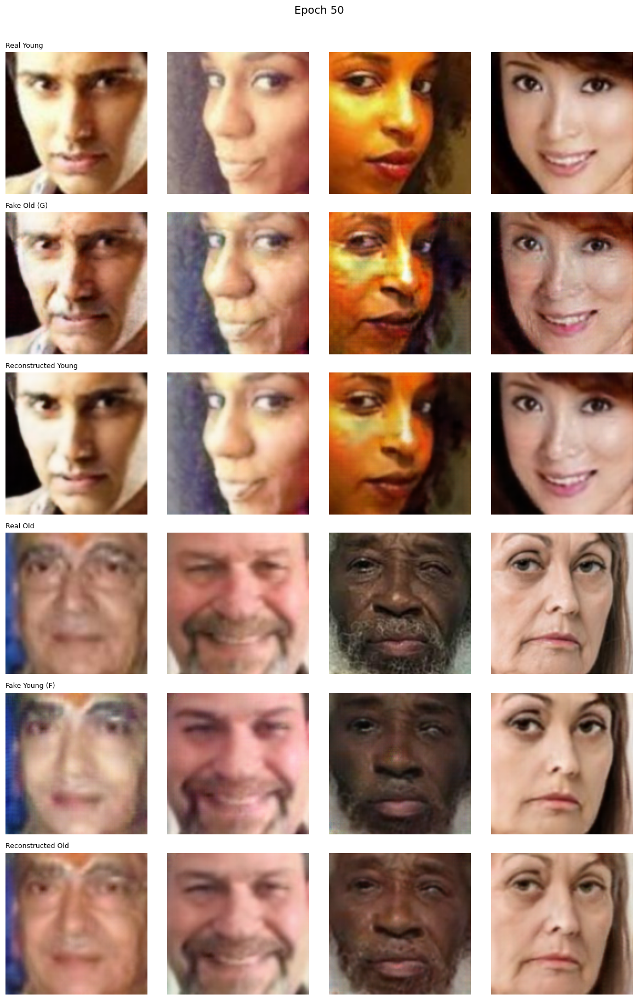
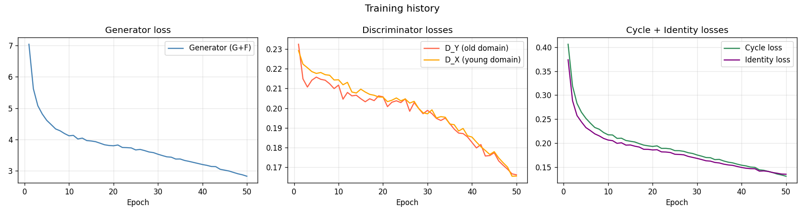

# Face Aging with CycleGAN — In-Depth Technical Documentation

**Project:** `cgan-aging-koukosias.py`  
**Author:** Koukosias Athanasios — UTH 2025-2026  
**Dataset:** UTKFace  
**Framework:** PyTorch

---

## Table of Contents

1. [Big Picture: What Problem Are We Solving?](#1-big-picture)
2. [Dataset Design](#2-dataset-design)
3. [Data Augmentation Pipeline](#3-data-augmentation)
4. [Generator Architecture](#4-generator-architecture)
5. [Discriminator Architecture](#5-discriminator-architecture)
6. [Loss Functions — Deep Dive](#6-loss-functions)
7. [Weight Initialization](#7-weight-initialization)
8. [The Training Step](#8-training-step)
9. [Learning Rate Scheduling](#9-lr-scheduling)
10. [Visualization Utilities](#10-visualization)
11. [Inference Pipeline](#11-inference)
12. [Hyperparameter Sensitivity Guide](#12-hyperparameters)
13. [Visual Results](#13-visual-results)

---

## 1. Big Picture: What Problem Are We Solving?

Standard image-to-image translation (e.g., Pix2Pix) requires **paired** data — a photo of person X at age 20 alongside a photo of the *same person* at age 60. Such datasets do not exist at scale.

**CycleGAN** sidesteps this requirement entirely. It only needs two *pools* of images:
- **Domain X:** Young faces (age 18–28)
- **Domain Y:** Old faces (age 40+)

No pairing is needed between them. The network learns the *style* of aging/de-aging purely from the statistical difference between the two domains. Identity is preserved not through paired supervision but through **cycle consistency**: if you age a face and then de-age it, you must recover the original.

### The Four-Network System

```
Domain X (Young) ──► G ──► Domain Y (Fake Old) ──► F ──► Recon X
Domain Y (Old)   ──► F ──► Domain X (Fake Young) ──► G ──► Recon Y

D_Y judges: real old  vs fake old  (output of G)
D_X judges: real young vs fake young (output of F)
```

G and F are generators with **separate weights** but **identical architecture**.  
D_Y and D_X are discriminators with **separate weights** but **identical architecture**.

---

## 2. Dataset Design

### `class UnpairedAgeDataset(Dataset)`

**Purpose:** Load and split UTKFace images into two unpaired domain pools.

#### UTKFace Filename Format
```
[age]_[gender]_[race]_[timestamp].jpg
```
The age is extracted from the filename prefix using `int(f.name.split("_")[0])`.

#### Age Domain Boundaries

| Domain | Age Range | Argument |
|--------|-----------|----------|
| Young (X) | 18 – 28 | `--young_min 18 --young_max 28` |
| Gap (excluded) | 29 – 39 | — |
| Old (Y) | 40+ | `--old_min 40` |

The gap (29–39) is deliberately excluded so the two domains are as distinct as possible. A model trained on overlapping domains would have a much harder time learning a consistent transformation.

#### Train / Val / Test Split

A deterministic split using a seeded `random.Random(seed)` object:

```python
cuts = {
    "train": files[:int(0.8 * n)],
    "val":   files[int(0.8*n):int(0.9*n)],
    "test":  files[int(0.9*n):]
}
```

- **80%** training, **10%** validation, **10%** test.
- The seed ensures the split is reproducible across runs.

#### Domain Balancing

```python
limit = min(len(self.young), len(self.old))
self.young = self.young[:limit]
self.old   = self.old[:limit]
```

UTKFace is not balanced — there are far more young faces than old faces. Truncating to the smaller domain prevents one generator from seeing more data than the other, which would cause asymmetric training quality.

#### Unpaired Sampling (`__getitem__`)

```python
old_idx = random.randint(0, len(self.old) - 1)
return self._load(self.young[idx]), self._load(self.old[old_idx])
```

The young image at position `idx` is paired with a *randomly chosen* old image — never the same person. This is the key property that makes the dataset suitable for CycleGAN.

---

## 3. Data Augmentation Pipeline

### `make_transforms(img_size, augment=True)`

#### Training Transforms (augment=True)

| Step | Operation | Why? |
|------|-----------|------|
| Resize to `img_size + 30` | e.g., 158×158 | Oversizes the image to allow random cropping |
| `RandomCrop(img_size)` | e.g., 128×128 | Provides spatial variation, acts as regularization |
| `RandomHorizontalFlip()` | 50% probability | Doubles effective dataset size; faces are symmetric |
| `ColorJitter(brightness=0.05, contrast=0.05)` | Subtle color shift | Prevents the model from memorizing lighting conditions |
| `ToTensor()` | Converts to float `[0, 1]` | Required for PyTorch |
| `Normalize([0.5]*3, [0.5]*3)` | Shifts to `[-1, 1]` | Matches the Tanh output range of the Generator |

#### Validation/Test Transforms (augment=False)

Same as above but `RandomCrop` is replaced with `CenterCrop` — deterministic, no jitter. This ensures validation metrics are comparable across epochs.

> **Why `[-1, 1]` normalization?** The Generator's final layer is a `Tanh`, which outputs in `[-1, 1]`. Normalizing inputs to the same range makes the model's input/output distributions consistent, which speeds up convergence.

---

## 4. Generator Architecture

### `class ResidualBlock(nn.Module)`

A single residual block contains:
1. `ReflectionPad2d(1)` — pads 1 pixel with reflected values
2. `Conv2d(channels, channels, 3)` — 3×3 convolution, preserves spatial size
3. `InstanceNorm2d(channels)` — normalizes per-image, per-channel
4. `ReLU(inplace=True)` — non-linearity
5. `ReflectionPad2d(1)`
6. `Conv2d(channels, channels, 3)`
7. `InstanceNorm2d(channels)`

The forward pass adds the input directly to the block output (skip connection):
```python
def forward(self, x):
    return x + self.block(x)
```

**Why reflection padding?** Zero-padding introduces artificial borders. Reflection padding mirrors the image at the edge, producing smoother outputs with fewer border artifacts — critical for face generation.

**Why InstanceNorm instead of BatchNorm?** BatchNorm normalizes across the whole batch, mixing style statistics between images. InstanceNorm normalizes each image independently, which is essential for style-transfer tasks where per-image appearance matters.

---

### `class Generator(nn.Module)`

**Parameters:** `ngf=64` (base filters), `n_res=9` (residual blocks)

#### Full Architecture Flow

```
Input (3, H, W)
    │
    ▼
[Initial Block]
  ReflectionPad2d(3)
  Conv2d(3 → ngf, 7×7)       ← large kernel to capture overall face structure
  InstanceNorm2d(ngf)
  ReLU
    │
    ▼
[Downsampling × 2]            ← Spatial: H → H/4,  Channels: ngf → ngf*4
  Conv2d(ngf   → ngf*2, 3×3, stride=2, pad=1)
  Conv2d(ngf*2 → ngf*4, 3×3, stride=2, pad=1)
    │
    ▼
[Residual Blocks × n_res]     ← The "bottleneck" where aging is learned
  ResidualBlock(ngf*4) × 9
    │
    ▼
[Upsampling × 2]              ← Spatial: H/4 → H,  Channels: ngf*4 → ngf
  ConvTranspose2d(ngf*4 → ngf*2, 3×3, stride=2, output_padding=1)
  ConvTranspose2d(ngf*2 → ngf,   3×3, stride=2, output_padding=1)
    │
    ▼
[Output Block]
  ReflectionPad2d(3)
  Conv2d(ngf → 3, 7×7)
  Tanh()                      ← Output in [-1, 1]
    │
    ▼
Output (3, H, W)
```

With `ngf=64`, the channel progression is: **3 → 64 → 128 → 256 → [9×256] → 128 → 64 → 3**

The encoder compresses the image into a 256-channel feature map at 1/4 spatial resolution. The 9 residual blocks operate in this compact space — this is where the model learns what "making a face look older" means in feature space. The decoder then expands back to the original resolution.

---

## 5. Discriminator Architecture

### `class Discriminator(nn.Module)`

**Parameters:** `ndf=64` (base filters)

#### PatchGAN Concept

Instead of outputting a single real/fake score for the whole image, PatchGAN outputs a **spatial grid of scores**, each score corresponding to a different overlapping region (patch) of the input. The final output is the average of all patch scores.

This is superior for texture-based tasks because:
- It forces the generator to make **every patch** look realistic.
- It captures local texture detail (wrinkles, pores, hair strands) that a global discriminator would ignore.

#### Layer Structure

| Layer | Operation | Output Channels | Stride |
|-------|-----------|-----------------|--------|
| 1 | Conv2d(3 → ndf, 4×4) + LeakyReLU | 64 | 2 |
| 2 | Conv2d(ndf → ndf*2, 4×4) + IN + LeakyReLU | 128 | 2 |
| 3 | Conv2d(ndf*2 → ndf*4, 4×4) + IN + LeakyReLU | 256 | 2 |
| 4 | Conv2d(ndf*4 → ndf*8, 4×4) + IN + LeakyReLU | 512 | **1** |
| 5 | Conv2d(ndf*8 → 1, 4×4) | 1 | 1 |

> Note: No InstanceNorm on the first layer — it receives raw pixel values where normalization would destroy useful low-level statistics.

The final stride-1 layers preserve spatial resolution, producing a grid of patch scores rather than a single value.

#### Global Pooling

```python
pooled = torch.nn.functional.avg_pool2d(patch_scores, patch_scores.shape[2:])
return pooled.view(x.size(0), -1)  # (B, 1)
```

Average-pooling over the spatial patch grid collapses it to a single scalar per image for use in the scalar loss functions.

---

## 6. Loss Functions — Deep Dive

### 6a. Adversarial Loss (LSGAN)

**Standard GAN** uses Binary Cross-Entropy. This suffers from vanishing gradients when the discriminator becomes very confident — the generator stops learning.

**LSGAN** replaces BCE with MSE, penalizing samples based on their *distance* from the target value rather than just whether they are on the right side of the decision boundary.

#### Discriminator Loss
```python
loss_real = mse_loss(real_pred, ones_like(real_pred))   # D(real)  → 1
loss_fake = mse_loss(fake_pred, zeros_like(fake_pred))  # D(fake)  → 0
loss_D = (loss_real + loss_fake) * 0.5
```
The `0.5` factor slows down the discriminator update relative to the generator — a standard GAN stabilization technique.

#### Generator Adversarial Loss
```python
loss_G_adv = mse_loss(fake_pred, ones_like(fake_pred))  # G wants D(fake) → 1
```
The generator is trying to make the discriminator score its fake images as 1 (real).

---

### 6b. Cycle Consistency Loss (L1, weight = `lambda_cyc=10`)

The core innovation of CycleGAN. For any image `x` from domain X:

```
x → G(x) = fake_y → F(fake_y) = recon_x
```

We then enforce: `||recon_x - x||₁ ≈ 0`

This is computed in **both directions**:
- Forward cycle: `young → G → fake_old → F → recon_young`
- Backward cycle: `old → F → fake_young → G → recon_old`

**Why L1 instead of L2?** L1 loss produces sharper reconstructions. L2 tends to average solutions, producing blurry images.

**Why weight=10?** The cycle loss must dominate the adversarial loss enough to prevent the generators from learning arbitrary mappings. If `lambda_cyc` is too low, identity can collapse (the generator ignores input structure). If it's too high, the aging effect becomes too subtle.

---

### 6c. Identity Loss (L1, weight = `lambda_id=5`)

Passes an image through the "wrong" generator — the one it doesn't need:

```
G(real_old)   should ≈ real_old   (G should be a no-op on already-old faces)
F(real_young) should ≈ real_young (F should be a no-op on already-young faces)
```

**Why?** Without this loss, the generators can freely change colors, backgrounds, and lighting — even when those changes are irrelevant to aging. The identity loss pins these irrelevant aspects.

**Why weight=5?** The original CycleGAN paper recommends `lambda_id = 0.5 × lambda_cyc`. Here `5 = 0.5 × 10`, following that recommendation.

---

### Combined Generator Loss

```
L_G_total = L_adv_G + L_adv_F
          + lambda_cyc × (L_cyc_forward + L_cyc_backward)
          + lambda_id  × (L_id_G + L_id_F)
```

Both G and F are updated jointly by this single combined loss.

---

## 7. Weight Initialization

```python
def weights_init(m):
    if isinstance(m, (nn.Conv2d, nn.ConvTranspose2d)):
        nn.init.normal_(m.weight, mean=0.0, std=0.02)
```

Convolutional weights are initialized from a **Gaussian distribution** with `mean=0.0, std=0.02`. This is the standard initialization for GANs (from the original DCGAN paper). It ensures weights start small and symmetric, preventing any single filter from dominating early training.

---

## 8. Training Step

### `train_step(real_young, real_old, G, F, D_Y, D_X, opt_G, opt_DY, opt_DX, cfg)`

All four model updates happen in a carefully ordered sequence each batch:

#### Step 1 — Forward Pass (no gradient updates yet)

```python
fake_old    = G(real_young)    # young → fake old
fake_young  = F(real_old)      # old   → fake young
recon_young = F(fake_old)      # fake old   → reconstructed young
recon_old   = G(fake_young)    # fake young → reconstructed old
same_old    = G(real_old)      # identity: old through G
same_young  = F(real_young)    # identity: young through F
```

Six forward passes are computed upfront and reused in the loss calculations below.

#### Step 2 — Update D_Y

```python
opt_DY.zero_grad()
loss_DY = adversarial_loss_D(D_Y(real_old), D_Y(fake_old.detach()))
loss_DY.backward()
opt_DY.step()
```

`fake_old.detach()` is critical — it stops gradients from flowing back into G during the discriminator update. D_Y only learns to distinguish real vs fake old faces.

#### Step 3 — Update D_X

Same as Step 2 but for the young domain using D_X.

#### Step 4 — Update G + F Jointly

```python
opt_G.zero_grad()
loss_G_total = adv_G + adv_F + lambda_cyc*(cyc_y + cyc_o) + lambda_id*(id_G + id_F)
loss_G_total.backward()
opt_G.step()
```

Note: `fake_old` is re-fed into `D_Y` here **without** `.detach()` — gradients must flow through the discriminator into the generator so G can learn to fool D_Y.

#### Returned Loss Dictionary

```python
return {"G": ..., "D_Y": ..., "D_X": ..., "cyc": ..., "id": ...}
```

These are used for logging and plotting the loss curves.

---

## 9. Learning Rate Scheduling

### Linear Decay Strategy

```python
def lr_lambda(epoch):
    decay_start = cfg.epochs // 2   # epoch 25 (for 50 total)
    if epoch < decay_start:
        return 1.0
    return max(0.0, 1.0 - (epoch - decay_start) / (cfg.epochs - decay_start))
```

- **Epochs 1–25:** Constant learning rate = `2e-4`
- **Epochs 26–50:** Linear decay from `2e-4` → `0`

This matches the original CycleGAN paper. The first half of training allows the model to learn a rough mapping; the second half allows it to refine details without overshooting.

All three optimizers (G+F, D_Y, D_X) share the same schedule to keep them in sync.

### Adam Optimizer — `betas=(0.5, 0.999)`

The default Adam `beta1=0.9` retains 90% of the momentum history. For GAN training, this can be too "sticky" — if the loss landscape shifts suddenly (as it often does in adversarial training), the optimizer is slow to adapt. Using `beta1=0.5` makes Adam forget old gradients faster, improving GAN stability.

---

## 10. Visualization Utilities

### `save_sample_grid(epoch, G, F, fixed_young, fixed_old, out_dir)`

Generates a 6-row × 4-column grid using 4 fixed validation images (the same 4 images every epoch for direct comparison):

| Row | Content |
|-----|---------|
| 1 | Real young faces |
| 2 | Fake old (G output) |
| 3 | Reconstructed young (cycle) |
| 4 | Real old faces |
| 5 | Fake young (F output) |
| 6 | Reconstructed old (cycle) |

The model is set to `.eval()` mode during generation (disables dropout, uses running stats for norms) and restored to `.train()` after.

#### `denorm(t)` helper

```python
return np.clip(t.permute(1, 2, 0).cpu().numpy() * 0.5 + 0.5, 0, 1)
```

Reverses the `Normalize([0.5]*3, [0.5]*3)` transform: shifts `[-1,1]` back to `[0,1]` for display. `permute(1,2,0)` reorders from PyTorch's `(C, H, W)` to matplotlib's `(H, W, C)`.

### `save_loss_curves(history, out_dir)`

Plots three panels after training completes:
1. **Generator loss** — should trend downward and stabilize
2. **Discriminator losses** (D_Y and D_X separately) — should stabilize near 0.25 (the LSGAN equilibrium for balanced competition)
3. **Cycle + Identity losses** — should trend downward indicating better reconstruction

### Training Health Check

Built into the epoch loop:

```python
d_avg = (avgs["D_Y"] + avgs["D_X"]) / 2
if d_avg < 0.05:
    status = "D too strong -- generators getting no learning signal"
elif d_avg > 0.8:
    status = "G fooling D easily -- possible mode collapse"
else:
    status = "balanced"
```

This heuristic monitors GAN balance. If D is perfect (`d_avg → 0`), G's adversarial gradients vanish. If G is perfect (`d_avg → 1`), the discriminator has collapsed and is no longer useful.

---

## 11. Inference Pipeline

### `infer(cfg)`

Runs aging/de-aging on a single input image.

1. **Load checkpoint:** Uses `--checkpoint` path or auto-picks the latest `.pth` file in `ckpt_dir`.
2. **Load models:** Instantiates G and F with the same architecture params, loads weights, sets `.eval()`.
3. **Preprocess:** Applies the validation transform pipeline (resize → center crop → normalize).
4. **Forward pass:**
   ```python
   aged    = G(img_t)   # young → old
   younger = F(img_t)   # also produces a de-aged version
   ```
5. **Output:** Saves a 1×3 panel: input | aged (G) | younger (F) to `./outputs/my_result.png`.

Note: Both directions are always run regardless of the actual age of the input photo.

---

## 12. Hyperparameter Sensitivity Guide

### Architecture Parameters

| Parameter | Default | Effect of Increasing | Effect of Decreasing |
|-----------|---------|----------------------|----------------------|
| `img_size` | `128` | More spatial detail, exponentially more VRAM and compute | Blurrier output, faster training |
| `ngf` | `64` | Higher model capacity, richer features, slower | Underfitting, less texture detail |
| `ndf` | `64` | Stronger discriminator, may overpower G | Weak discriminator, easy for G to fool |
| `n_res` | `9` | Deeper bottleneck, better at complex transformations | Shallower, may miss subtle aging cues |

> **Rule of thumb:** For `img_size=256`, increase `n_res` to 9 (already at default). For `img_size=64`, 6 residual blocks may suffice.

### Training Parameters

| Parameter | Default | Effect of Increasing | Effect of Decreasing |
|-----------|---------|----------------------|----------------------|
| `lr` | `2e-4` | Faster but unstable; oscillating losses | Slow convergence; very stable |
| `epochs` | `50` | Better convergence, diminishing returns after ~100 | Undertrained, poor quality |
| `batch_size` | `4` | Smoother gradients, needs more VRAM | Noisier gradients, may destabilize |
| `lambda_cyc` | `10.0` | Stronger identity preservation; subtle aging | Aggressive aging; may lose identity |
| `lambda_id` | `5.0` | Better background/color preservation | Color drift; background artifacts |

### Age Domain Parameters

| Parameter | Default | Effect |
|-----------|---------|--------|
| `young_min` | `18` | Lower: includes teens; larger pool but noisier |
| `young_max` | `28` | Higher: overlaps with gap; domains less distinct |
| `old_min` | `40` | Lower: includes middle-age; reduces visual gap |

Narrowing the age gap between domains makes the task *harder* — the discriminator struggles to tell the difference and the generators receive weaker learning signals.

---

## 13. Visual Results

### Epoch 50 — Sample Grid

Shows the model's translations after 50 epochs of training. Each column is a different face from the validation set.



### Training Loss Curves

The loss history across all 50 epochs. Stable, converging curves indicate healthy GAN training.



---

*UTH Advanced Machine Learning Techniques 2025-2026*
