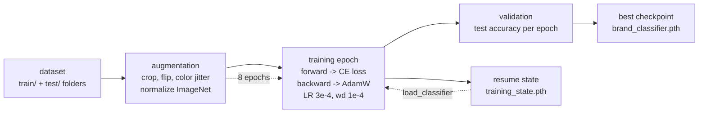

# Car Brand Counter

Detect cars in a local `.mp4` video, classify each tracked car by brand, and save an annotated output video with bounding boxes, track ids, brand probabilities, and live brand counts.

The project uses two scripts:

```text
group_by_brand.py      # prepares train/test data once
car_brand_counter.py   # trains/loads the model and processes the video
```

## Data Layout

The main script expects the dataset to already be grouped into train/test folders:

```text
grouped-cars/
  train/
    Toyota/
    Honda/
    BMW/
  test/
    Toyota/
    Honda/
    BMW/
```

Create this layout from the original raw dataset with:

```bash
python3 group_by_brand.py 60k-car-dataset --dst grouped-cars
```

`group_by_brand.py` uses:

```python
TRAIN_RATIO = 0.80
SEED = 42
```

So each brand is split into 80% train and 20% test in a reproducible way.

## Environment

Install dependencies directly:

```bash
pip install -r requirements.txt
```

Or create the Python 3.12 CUDA-ready virtual environment:

```bash
bash setup_venv.sh
source .venv/bin/activate
```

Check CUDA driver visibility with:

```bash
nvidia-smi
```

If `nvidia-smi` fails, PyTorch can still install, but CUDA training will not work until the NVIDIA driver is fixed.

## Run

Edit the constants at the top of `car_brand_counter.py`:

```python
DATA_DIR = "grouped-cars/"
VIDEO_PATH = "traffic.mp4"
OUTPUT_VIDEO = "outputs/annotated.mp4"
EPOCHS = 8
BATCH_SIZE = 32
```

Then run:

```bash
python3 car_brand_counter.py
```

There are no command-line arguments in the main script now. The script only uses local video files; it does not download videos from the internet.

## Outputs

The main script writes:

```text
outputs/annotated.mp4
outputs/annotated.json
models/brand_classifier.pth
models/training_state.pth
```

`outputs/annotated.mp4` contains the original video with:

```text
bounding boxes around detected cars
track ids
predicted brand labels
brand probability per tracked car
live counts per brand
```

`outputs/annotated.json` contains:

```json
{
  "total_unique_cars": 0,
  "brands": {},
  "tracks": {}
}
```

## Checkpoints

Two checkpoints are saved:

```text
models/brand_classifier.pth
models/training_state.pth
```

`brand_classifier.pth` stores the best model by test accuracy. This is the model used later for video processing.

`training_state.pth` stores the last completed epoch, model weights, optimizer state, brand names, and best accuracy. If training crashes or is interrupted before `EPOCHS`, rerun:

```bash
python3 car_brand_counter.py
```

Training resumes from the next epoch instead of starting from zero.

## Architecture

The application has two learning components:

```text
YOLOv8 + ByteTrack        -> car detection and tracking
MobileNetV3-Small         -> brand classification from car crops
```

### Video Pipeline Diagram

```mermaid
flowchart LR
  subgraph input[input]
    video["video file<br/>traffic.mp4"]
    sampler["frame sampler<br/>FRAME_SKIP, ROI filter"]
    detector["YOLOv8n detector<br/>YOLO_CONF=0.4, class 2"]
    tracker["ByteTrack<br/>assigns track ids"]
  end

  subgraph classify[classify]
    crop["crop extractor<br/>MIN_CROP=50 px guard"]
    tfm["transforms<br/>resize, normalize"]
    clf["MobileNetV3-Small<br/>fine-tuned brand head"]
    vote["vote aggregator<br/>confidence scores per track"]
  end

  subgraph output[output]
    annotate["frame annotator<br/>boxes, labels, count panel"]
    writer["MP4 writer<br/>annotated.mp4"]
    json["JSON export<br/>counts + track brands"]
  end

  video --> sampler --> detector --> tracker
  tracker --> crop --> tfm --> clf --> vote
  vote --> annotate --> writer --> json
```



### Training Diagram



### Component Choices

`YOLOv8n` is the nano YOLOv8 detector. It is used because speed matters more than maximum detector accuracy in this project. It can run quickly on video frames, even without a GPU, and cars are usually large enough in traffic footage that the lightweight detector is a good fit.

`ByteTrack` is used instead of simple frame-by-frame detection counting because it keeps stable ids for cars over time. If a car is briefly occluded by another vehicle, the tracker can reconnect the detection to the same track id instead of counting it again.

`MobileNetV3-Small` is a compact CNN designed for mobile and edge inference. The model starts from ImageNet pretrained weights, then the final classifier layer is replaced with a new linear layer whose output size equals the number of car brands. This is transfer learning: the pretrained visual features already know useful edges, shapes, textures, and object parts, so the project needs less brand-labeled data than training a CNN from scratch.

The current implementation fine-tunes all MobileNetV3-Small parameters after replacing the head. If faster training is preferred over maximum adaptation, the backbone can be frozen and only the final linear head can be trained.

`AdamW` is used with:

```python
LR = 3e-4
weight_decay = 1e-4
```

This is a reliable default for fine-tuning pretrained vision models. The learning rate is high enough for the classifier to adapt, while weight decay helps reduce overfitting.

`YOLO_CONF = 0.4` is a middle-ground detection threshold. Lower values can add false positives, while higher values can miss partially occluded vehicles. For counting, `0.4` leans toward recall so fewer cars are missed.

`IMG_SIZE = 224` matches the standard input size used by MobileNetV3 ImageNet training. Keeping the same size and normalization makes the pretrained features behave as expected.

`FRAME_SKIP = 1` means every frame is processed. Increase it to `2`, `3`, or `5` if the machine is slow and speed is more important than maximum tracking precision.

`MIN_CROP = 50` discards very small boxes. Crops below roughly `50x50` pixels do not contain enough visual detail for reliable brand classification.

`BATCH_SIZE = 32` and `EPOCHS = 8` are conservative defaults for a fine-tuning job. A batch size of 32 is usually stable, and 8 epochs gives the pretrained network time to adapt without making the first run unnecessarily long.

ImageNet mean/std normalization is required because the MobileNet backbone was pretrained with that input distribution:

```python
MEAN = [0.485, 0.456, 0.406]
STD = [0.229, 0.224, 0.225]
```

Using different normalization would degrade the value of the pretrained weights.

### Dataset Preparation

`group_by_brand.py` reads raw car folders or files and extracts the brand from the first token in the name:

```text
Toyota_Corolla_2017  -> Toyota
Honda Civic 2018     -> Honda
BMW_3Series_2020     -> BMW
```

It groups items per brand and splits each brand independently into train/test. Splitting per brand matters because it keeps the train and test sets balanced across brands.

### Brand Classifier

The classifier is `MobileNetV3-Small` from `torchvision.models`.

The original ImageNet classification head is replaced with:

```python
nn.Linear(model.classifier[-1].in_features, number_of_brands)
```

This gives one softmax output per brand folder in:

```text
grouped-cars/train/<brand>
```

Training uses:

```text
CrossEntropyLoss
AdamW optimizer
ImageNet normalization
random resized crop
horizontal flip
color jitter
tqdm progress bars
```

The test transform is deterministic:

```text
resize
center crop
normalize
```

This keeps test accuracy stable between runs.

### Detection And Tracking

The video side uses Ultralytics YOLO:

```python
yolo.track(..., tracker="bytetrack.yaml")
```

YOLO detects objects in each frame. The script filters detections using:

```python
CLASSES = [2]
```

In COCO labels, class `2` is `car`. To include buses and trucks, edit:

```python
CLASSES = [2, 5, 7]
```

ByteTrack gives each detected car a stable `track_id`. That prevents counting the same car again on every frame.

### Brand Voting

Every time a tracked car appears, its crop is classified by the MobileNet model. The script does not trust just one frame. Instead, it accumulates confidence scores per track:

```text
track 3:
  Toyota += 0.72
  Toyota += 0.81
  Honda  += 0.20
```

The winning brand is the brand with the largest total confidence for that track. The displayed probability is:

```text
winning brand score / total score for that track
```

This makes the result more stable when one crop is blurry or partially occluded.

### Counting Logic

The final count is based on unique ByteTrack ids, not raw detections. If the same car appears for 100 frames, it is still counted once.

The JSON output maps each track id to its resolved brand:

```json
{
  "tracks": {
    "1": "Toyota",
    "2": "BMW"
  }
}
```

Then the script counts how many unique tracks belong to each brand.

### Area Filtering

By default:

```python
ROI = None
```

This means every detected car is counted. To count cars only inside a region, set:

```python
ROI = [100, 150, 900, 700]
```

The script checks whether the center of the bounding box is inside this rectangle.

### Annotation

For each tracked car, the output frame receives:

```text
colored bounding box
#track_id
brand name
stable brand probability
```

A live panel in the top-left corner shows current unique-car counts per brand.

## Important Constants

Edit these in `car_brand_counter.py`:

```python
DATA_DIR = "grouped-cars/"
VIDEO_PATH = "traffic.mp4"
OUTPUT_VIDEO = "outputs/annotated.mp4"
CKPT_PATH = "models/brand_classifier.pth"
TRAIN_STATE_PATH = "models/training_state.pth"
DETECTOR = "yolov8n.pt"
EPOCHS = 8
BATCH_SIZE = 32
LR = 3e-4
FRAME_SKIP = 1
YOLO_CONF = 0.4
MIN_CROP = 50
CLASSES = [2]
ROI = None
```

## Notes

The first run can take time because it trains the brand classifier.

After training finishes, future runs load `models/brand_classifier.pth` and go directly to video processing.

If you change the dataset brands, delete old checkpoints before retraining:

```bash
rm models/brand_classifier.pth models/training_state.pth
```
## Important Links
https://datature.io/blog/introduction-to-bytetrack-multi-object-tracking-by-associating-every-detection-box
https://docs.pytorch.org/vision/main/models/generated/torchvision.models.mobilenet_v3_small.html
