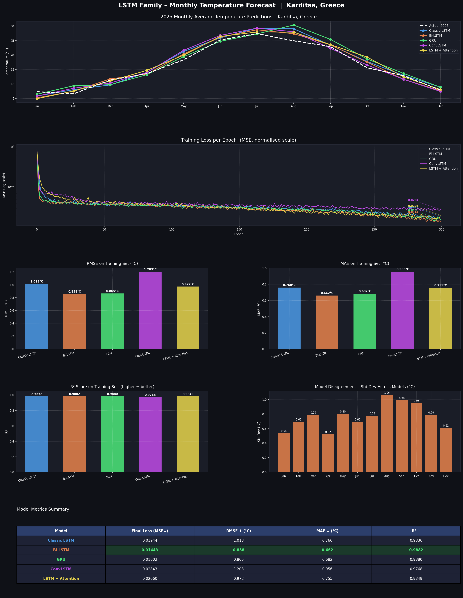

# LSTM Weather Prediction — Full Project Documentation
### Karditsa, Greece | Monthly Temperature Forecasting
**Author:** Koukosias Athanasios — UTH 2026  
**Dataset:** OpenMeteo Free API

---

## Table of Contents

### Quick Jump — Files
1. [config.py](#configpy) — Global hyperparameters and settings
2. [data.py](#datapy) — Data fetching, caching, and preprocessing
3. [train.py](#trainpy) — Training loop, Adam optimiser, and inference
4. [model_lstm.py](#model_lstmpy) — Classic stacked LSTM
5. [model_bilstm.py](#model_bilstmpy) — Bidirectional LSTM
6. [model_gru.py](#model_grupy) — Gated Recurrent Unit
7. [model_convlstm.py](#model_convlstmpy) — Conv1D → LSTM
8. [model_attention_lstm.py](#model_attention_lstmpy) — LSTM + Bahdanau Attention
9. [main.py](#mainpy) — Orchestration, metrics, and plotting

### Quick Jump — Concepts
- [What is BPTT?](#what-is-bptt)
- [What are the LSTM gates?](#what-are-the-lstm-gates)
- [Why implement from scratch instead of PyTorch/Keras?](#why-from-scratch)
- [How does autoregressive prediction work?](#autoregressive-prediction)
- [Understanding the weight matrices (W, U, b)](#understanding-weight-matrices)

---

## Project Overview

This project trains five different recurrent neural network architectures to predict monthly average temperatures for Karditsa, Greece, using historical data from 2018–2024 and then forecasting the 12 months of 2025. All models are implemented **entirely from scratch using only NumPy** — no PyTorch, no TensorFlow, no Keras. Every gate computation, every gradient, and the entire Adam optimiser are written by hand.

This is intentional. The goal is to understand what happens inside the black box that `nn.LSTM()` or `keras.LSTM()` hides from you.

### Results Plot



*Figure 1: The full output dashboard — 2025 predictions for all five models (top), training loss curves (second row), RMSE/MAE bar charts (third row), model disagreement and the metrics summary table (bottom rows).*

---

## Why From Scratch?

When you use a framework like PyTorch or Keras, a complete LSTM model looks like this:

```python
# PyTorch — the "normal" way
import torch.nn as nn

class LSTMModel(nn.Module):
    def __init__(self):
        super().__init__()
        self.lstm = nn.LSTM(input_size=1, hidden_size=128, num_layers=1, batch_first=True)
        self.fc   = nn.Linear(128, 1)

    def forward(self, x):
        out, _ = self.lstm(x)
        return self.fc(out[:, -1, :])

model = LSTMModel()
optimizer = torch.optim.Adam(model.parameters(), lr=1e-3)
```

That single call to `nn.LSTM()` hides hundreds of lines of gate computations, weight initialisation, and gradient calculations. This project implements all of that manually. The tradeoff: more code, but complete transparency into every number and every operation.

---

## What is BPTT?

**Backpropagation Through Time (BPTT)** is the algorithm used to train recurrent networks. In a standard feedforward network, you compute gradients layer by layer going backwards. In a recurrent network, the same cell is applied at each timestep (each month, in this project), so you have to "unroll" it through time and then backpropagate through each step.

Concretely: during the forward pass you save the gate activations (I, F, G, O) and states (H, C) at every timestep. During the backward pass you loop from `t = T-1` back to `t = 0`, computing how much each weight contributed to the final error at each step. The gradients accumulate with `+=` across all timesteps.

Every `forward_and_grad()` function in this project implements exactly this.

---

## What are the LSTM gates?

An LSTM cell processes one input at a time (one month's temperature in normalised form) and maintains two running memories: the **hidden state h** (short-term context) and the **cell state C** (long-term memory). At each timestep, four "gates" control what happens:

| Gate | Variable | Activation | Role |
|------|----------|------------|------|
| Input gate | `i_g` | sigmoid → [0,1] | How much of the new information to write |
| Forget gate | `f_g` | sigmoid → [0,1] | How much of the old cell state to erase |
| Candidate | `g_g` | tanh → [-1,1] | The actual new information to potentially write |
| Output gate | `o_g` | sigmoid → [0,1] | How much of the cell state to expose as hidden state |

The cell update equations are:

```
C_new = f_g * C_old + i_g * g_g    # erase some, write some
h_new = o_g * tanh(C_new)          # expose filtered version
```

All four gates take the same two inputs: the current input `x` (this month's temperature) and the previous hidden state `h`. The difference between them is their learned weight matrices (W, U, b).

---

## Understanding Weight Matrices

Every gate has three sets of parameters:

- **W** (shape: `hidden_size × input_dim`) — multiplies the input `x`
- **U** (shape: `hidden_size × hidden_size`) — multiplies the previous hidden state `h`
- **b** (shape: `hidden_size`) — a bias vector added to the result

The computation for the forget gate looks like:

```python
f_g = sigmoid(Wf @ x + Uf @ h_prev + bf)
```

`@` is matrix multiplication. The result is a vector of `hidden_size` values, each between 0 and 1, telling the cell how much of each dimension of `C` to retain. All four gates have this same structure with their own W, U, b.

At the output, `Wy` (shape: `hidden_size`) and `by` (scalar) project the final hidden state down to a single temperature prediction number.

---

## Autoregressive Prediction

After training, to predict 12 months of 2025, the model uses **autoregressive inference**: it feeds the last 6 months of known data (the seed) to get month 1, then appends that prediction to the buffer, uses the last 6 values to get month 2, and so on. Each new prediction becomes an input for the next step.

```python
buf = list(seed_seq[-SEQ_LEN:])   # last 6 months of training data
for _ in range(12):
    x = np.array(buf[-SEQ_LEN:])
    p = forward(x, weights)
    buf.append(p)
```

This means prediction errors can compound: if month 1 is slightly off, month 2 uses that wrong value as input. This is why the model disagreement chart (bottom-right of the dashboard) shows increasing spread in later months.

---

---

# config.py

> **Quick jump:** [HIDDEN_SIZE](#hidden_size) · [NUM_LAYERS](#num_layers) · [LEARNING_RATE](#learning_rate) · [EPOCHS](#epochs) · [SEQ_LEN](#seq_len) · [CLIP_GRAD](#clip_grad) · [TRAIN_YEARS](#train_years) · [PREDICT_YEAR](#predict_year) · [LAT / LON](#lat--lon) · [CACHE_CSV](#cache_csv) · [SEED](#seed) · [MONTHS](#months)

`config.py` is a single file of named constants. Its only job is to be the one place where you change a value and have it propagate everywhere. Every other file imports from it.

---

### HIDDEN_SIZE

```python
HIDDEN_SIZE = 128
```

The number of units (neurons) in each LSTM/GRU layer. This determines the size of the hidden state vector `h` and the cell state vector `C`. A larger value gives the model more capacity to represent complex patterns but also means more parameters and slower training. With 7 years × 12 months = 84 training samples, 128 is a reasonable choice — large enough to learn seasonal patterns without wildly overfitting.

This directly sets the shapes of all W and U matrices: `Wi` is `(128, 1)`, `Ui` is `(128, 128)`, etc.

---

### NUM_LAYERS

```python
NUM_LAYERS = 1
```

How many LSTM layers to stack. With `NUM_LAYERS = 2`, the output sequence of the first LSTM (the hidden states at each timestep) becomes the input sequence of the second LSTM. Stacking allows the model to learn hierarchical temporal features. However, with only 84 training samples, adding layers increases the risk of overfitting and slows training significantly. One layer is sensible here.

---

### LEARNING_RATE

```python
LEARNING_RATE = 1e-3
```

The step size for the Adam optimiser — `0.001`. After computing gradients, each weight is nudged in the direction that reduces the loss, scaled by this factor. Too large and training becomes unstable (loss oscillates or diverges). Too small and training converges very slowly. `1e-3` is the standard default for Adam and generally works well across a wide range of problems.

---

### EPOCHS

```python
EPOCHS = 300
```

The number of complete passes through the training data. One epoch = seeing all 78 training sequences (84 months minus 6 for the seed window) once. 300 epochs is enough for the loss curves to flatten in most models, as visible in the second panel of the dashboard (plots/plot1.png).

---

### SEQ_LEN

```python
SEQ_LEN = 6
```

The look-back window: how many past months the model sees to predict the next one. A window of 6 means the model sees January–June to predict July, then February–July to predict August, and so on. Six months captures half a year of seasonal context. Longer windows give more context but also increase the number of BPTT steps and reduce the number of training sequences.

---

### CLIP_GRAD

```python
CLIP_GRAD = 5.0
```

The maximum allowed global gradient norm before clipping. During BPTT, gradients can grow exponentially as they are multiplied through many timesteps — this is the famous **exploding gradient problem**. Global gradient clipping scales down all gradients proportionally when their combined norm exceeds this threshold. It prevents a single bad batch from causing the weights to jump to a catastrophic region of the loss surface.

---

### TRAIN_YEARS

```python
TRAIN_YEARS = list(range(2018, 2025))   # [2018, 2019, 2020, 2021, 2022, 2023, 2024]
```

The years used for training data. Seven years × 12 months = 84 monthly temperature values. These define the normalisation statistics (mean `mu` and standard deviation `sigma`) that all models use.

---

### PREDICT_YEAR

```python
PREDICT_YEAR = 2025
```

The year to forecast. The model never sees 2025 data during training. If actual 2025 data is available in the fetched dataset, `main.py` will plot it as the white dashed line for comparison (as shown in the top panel of plot1.png).

---

### LAT / LON

```python
LAT = 39.3637
LON = 21.9214
```

Geographic coordinates of Karditsa, Greece. Passed directly to the OpenMeteo API to specify which weather station's data to retrieve.

---

### CACHE_CSV

```python
CACHE_CSV = "weather_cache.csv"
```

The filename for the local data cache. After the first API fetch, the daily temperature data is saved as a CSV. On subsequent runs, `data.py` checks whether the cached file covers the required date range and loads it directly, avoiding a network request. Set to `None` to always re-fetch.

---

### SEED

```python
SEED = 42
```

The random seed passed to NumPy's random number generator during weight initialisation. Every model uses this seed so that results are reproducible across runs. Without a fixed seed, different runs would produce different initial weights and potentially converge to different solutions.

---

### MONTHS

```python
MONTHS = ["Jan", "Feb", "Mar", "Apr", "May", "Jun",
          "Jul", "Aug", "Sep", "Oct", "Nov", "Dec"]
```

A convenience list of month abbreviations used for axis labels in the plots.

---

---

# data.py

> **Quick jump:** [fetch_open_meteo()](#fetch_open_meteo) · [load_daily()](#load_daily) · [build_monthly()](#build_monthly) · [prepare_training_data()](#prepare_training_data)

`data.py` handles everything related to obtaining and shaping the raw data before any model sees it. It talks to the OpenMeteo API, manages the cache, aggregates daily readings into monthly averages, normalises the values, and builds the sliding-window sequences used for training.

---

### fetch_open_meteo()

```python
def fetch_open_meteo(start: str, end: str) -> pd.DataFrame:
```

**What it does:** Makes an HTTP GET request to the OpenMeteo historical archive API for daily mean temperatures at the configured latitude/longitude. Parses the JSON response into a Pandas DataFrame with columns `date` and `temp`. Calls `.interpolate()` on the temperature column to fill any rare missing days using linear interpolation between neighbours.

**Why this API:** OpenMeteo is free, requires no API key, and provides historical weather data going back decades. The `archive-api.open-meteo.com/v1/archive` endpoint specifically returns verified historical measurements, not forecasts.

**Why `.interpolate()`:** Weather APIs occasionally have missing entries due to station outages. A few missing days in a monthly average have negligible impact, and linear interpolation between adjacent days is more accurate than filling with zeros or the column mean.

---

### load_daily()

```python
def load_daily() -> pd.DataFrame:
```

**What it does:** Determines the full date range needed (spanning both `TRAIN_YEARS` and `PREDICT_YEAR`), then either loads from the CSV cache or calls `fetch_open_meteo()`. Cache validity is checked by comparing the min and max dates in the cached file against the required range. If the cache is stale or incomplete, it re-fetches and overwrites the cache.

**Why cache:** The training loop and the prediction step both need the full dataset. Without a cache, every run would trigger a network request. The cache also makes the project work offline once data has been fetched once.

**Why not just always re-fetch:** Network reliability is not guaranteed. A cached file also gives deterministic data — the API could in principle update historical values if corrections are made.

---

### build_monthly()

```python
def build_monthly(daily: pd.DataFrame) -> pd.DataFrame:
```

**What it does:** Groups the daily DataFrame by `(year, month)` and takes the mean temperature for each group. Returns a DataFrame with columns `[year, month, temp]` sorted chronologically.

**Why monthly averages:** The models predict at monthly granularity. Training on daily data would require much longer sequences (365+ steps) to capture the same seasonal patterns, and would multiply training time enormously. Monthly aggregation is both computationally appropriate and physically meaningful — the seasonal cycle is a monthly phenomenon.

---

### prepare_training_data()

```python
def prepare_training_data(monthly: pd.DataFrame):
    # Returns: X, y, norm_train, mu, sigma
```

**What it does:** Extracts the training years' temperatures, computes the global mean `mu` and standard deviation `sigma`, normalises all temperatures to zero-mean unit-variance, then builds sliding-window sequences of length `SEQ_LEN`.

**Normalisation — why it matters:** Raw temperatures range from roughly -2°C to 35°C in Karditsa. Neural network weights are initialised near zero and activation functions like sigmoid and tanh operate most efficiently near zero. If you feed raw temperatures, the input signal is far from the operating range of these activations, and training becomes slow or unstable. Normalising forces the inputs (and targets) into a [-2, 2] range where the network learns comfortably.

**Why use only training-year statistics for normalisation:** Computing `mu` and `sigma` from all data (including 2025) would be **data leakage** — the model would implicitly know something about the 2025 distribution at training time. By computing statistics only from 2018–2024, the 2025 predictions are made from a truly unseen distribution. The 2025 predictions are de-normalised using the same `mu` and `sigma` when displaying results.

**Sliding window construction:**
```
norm_train = [v0, v1, v2, v3, v4, v5, v6, v7, ...]
                                                
X[0] = [v0, v1, v2, v3, v4, v5],  y[0] = v6
X[1] = [v1, v2, v3, v4, v5, v6],  y[1] = v7
...
```
Each row of `X` is a 6-month input window; the corresponding `y` is the month immediately following. This gives `N = 84 - 6 = 78` training pairs.

**`norm_train` as the inference seed:** The last 6 values of the normalised training series become the starting buffer for autoregressive 2025 prediction. This ensures the prediction seed is in the same normalised space as the training sequences.

---

---

# train.py

> **Quick jump:** [make_adam_state()](#make_adam_state) · [adam_step()](#adam_step) · [clip_grads()](#clip_grads) · [train()](#train) · [predict_year()](#predict_year)

`train.py` is completely model-agnostic. It knows nothing about gates or LSTM internals — it only knows that it receives a function that takes `(x, y_true, weights)` and returns `(loss, grads)`, and it applies Adam updates. Every model plugs into it identically.

---

### make_adam_state()

```python
def make_adam_state(weights: list) -> dict:
```

**What it does:** Creates the Adam optimiser's moment estimates — `m` (first moment, like a momentum vector) and `v` (second moment, like a per-weight variance estimate). Both are initialised to zero arrays with the same shapes as the weights. `t` (the step counter) starts at 0.

**Why Adam needs state:** Unlike plain stochastic gradient descent (SGD) which just subtracts `lr * grad`, Adam maintains a running average of past gradients (`m`) and a running average of past squared gradients (`v`). This allows it to adapt the effective learning rate for each weight individually — weights that receive large gradients get their learning rate automatically reduced, while weights with small gradients get a larger effective step. This is especially useful for RNNs where different weights receive very different gradient magnitudes.

---

### adam_step()

```python
def adam_step(weights, grads, state, lr, beta1=0.9, beta2=0.999, eps=1e-8):
```

**What it does:** Performs one Adam parameter update in-place across all weight arrays simultaneously.

**The full Adam algorithm, step by step:**

```python
state["t"] += 1                                    # increment step counter
m = beta1 * m + (1 - beta1) * g                   # update biased first moment
v = beta2 * v + (1 - beta2) * g * g               # update biased second moment
m_hat = m / (1 - beta1 ** t)                      # bias correction (m is near 0 early)
v_hat = v / (1 - beta2 ** t)                      # bias correction (v is near 0 early)
w -= lr * m_hat / (sqrt(v_hat) + eps)             # parameter update
```

**Why bias correction:** At step 1, `m` is initialised to 0, so `m = 0.9*0 + 0.1*g = 0.1*g`. This under-estimates the true gradient by a factor of 10. Dividing by `(1 - 0.9^1) = 0.1` corrects it back to `g`. As `t` grows, `beta^t → 0` and the correction factor approaches 1.

**Why `eps=1e-8`:** Prevents division by zero when a weight's gradient has been zero for many steps (making `v_hat` very small). Also prevents numerical instability when `v_hat` is genuinely tiny.

**Why `beta1=0.9, beta2=0.999`:** These are the original values from the Adam paper (Kingma & Ba, 2014) and remain the near-universal defaults. `beta2` being closer to 1 means the variance estimate changes more slowly, providing stability.

---

### clip_grads()

```python
def clip_grads(grads: list, max_norm: float = CLIP_GRAD) -> list:
```

**What it does:** Computes the global L2 norm across all gradient arrays combined. If this total norm exceeds `max_norm`, scales every gradient array by `max_norm / total_norm`. Returns the (potentially scaled) gradient list.

**Why global norm clipping instead of per-weight clipping:** Per-weight clipping (clamping each gradient independently) distorts the gradient *direction* — it might clip the gradient for one weight heavily while leaving another untouched, changing which direction the combined update points. Global norm clipping preserves the relative proportions between all gradients (the direction) and only scales down the magnitude. This is always preferred for RNNs.

**Why RNNs especially need this:** During BPTT, gradients from early timesteps are computed by multiplying many Jacobians together. If any of those Jacobians has eigenvalues > 1, the gradient grows exponentially with sequence length. For a sequence of length 6 this is manageable, but gradient clipping is a cheap safeguard.

---

### train()

```python
def train(forward_and_grad_fn, weights, X, y, name) -> list:
```

**What it does:** Runs `EPOCHS` training epochs. Each epoch randomly shuffles the training indices and processes every sample. For each sample it calls `forward_and_grad_fn(X[i], y[i], weights)` to get the loss and gradients, clips the gradients, then calls `adam_step`. Averages the loss across the epoch and appends it to the losses list. Displays a progress bar via `tqdm`.

**Why random shuffling (`np.random.permutation`):** If samples were processed in chronological order every epoch, the model would see spring always before summer and might implicitly learn the order of presentation rather than the temporal patterns. Random shuffling breaks this dependency, improves gradient diversity within each epoch, and generally leads to better generalisation.

**Why online (sample-by-sample) updates rather than full-batch:** With 78 training samples, a full-batch gradient would be stable but each epoch would update the weights only once. Online updates (one weight update per sample) are noisier but give 78 updates per epoch, which generally leads to faster practical convergence for small datasets. True mini-batching (e.g. batch size 8) is a middle ground, but online is simpler to implement with variable-length sequences.

---

### predict_year()

```python
def predict_year(forward_fn, weights, seed_seq) -> list:
```

**What it does:** Takes the last `SEQ_LEN` values from `seed_seq` (the normalised training sequence) as the starting buffer. Loops 12 times: each iteration calls `forward_fn` on the last 6 values of the buffer, appends the prediction to the buffer, then uses the updated buffer for the next month.

**Why this is called autoregressive:** Each output feeds back as the next input. The model is consuming its own predictions. This is necessary because there is no ground truth to feed during inference. The risk is error accumulation — if month 1 is slightly wrong, month 2 uses that wrong value, and so on. This is visible in the widening spread between models in the later months of plot1.png (the disagreement chart).

**Why the buffer starts with training data:** The model was trained on sequences from the training period. Starting with the last 6 months of that training data puts the model in a state consistent with what it learned — it "knows" it is at the end of 2024 and should predict 2025. Starting with zeros or random values would put it in an unfamiliar context.

---

---

# model_lstm.py

> **Quick jump:** [sigmoid / sigmoid_grad / tanh_grad](#sigmoid--sigmoid_grad--tanh_grad-lstm) · [init_weights()](#init_weights-lstm) · [_unpack()](#_unpack-lstm) · [_lstm_layer_fwd()](#_lstm_layer_fwd) · [forward()](#forward-lstm) · [forward_and_grad()](#forward_and_grad-lstm) · [run()](#run-lstm) · [train_model() / predict_year_from_weights()](#train_model--predict_year_from_weights-lstm)

`model_lstm.py` is the reference implementation — the simplest version. A stacked LSTM reads the 6-month sequence left to right and uses the final hidden state to produce a single scalar prediction.

---

### sigmoid / sigmoid_grad / tanh_grad (LSTM)

```python
def sigmoid(x):
    x = np.clip(x, -30, 30)
    return 1.0 / (1.0 + np.exp(-x))

def sigmoid_grad(s): return s * (1.0 - s)
def tanh_grad(t): return 1.0 - t * t
```

**Why clip for sigmoid:** `np.exp(-x)` overflows to `inf` for `x < -710`. Clipping to [-30, 30] prevents this — `sigmoid(-30) ≈ 9e-14` and `sigmoid(30) ≈ 1 - 9e-14`, both numerically indistinguishable from 0 and 1 respectively.

**Why pass the *output* to the gradient functions, not the input:** `sigmoid_grad(s)` where `s = sigmoid(x)` uses the identity `d/dx sigmoid(x) = sigmoid(x) * (1 - sigmoid(x))`. Since we already computed `s` during the forward pass and cached it (in `I`, `F`, `O` lists), we pass `s` directly rather than recomputing `sigmoid(x)` from scratch. This avoids redundant computation during the backward pass. Same principle for `tanh_grad`.

---

### init_weights() (LSTM)

```python
def init_weights() -> list:
```

**What it does:** Creates and returns a list of NumPy arrays, one for each learnable parameter. The layout is:

```
Layer 0: Wi Wf Wg Wo Ui Uf Ug Uo bi bf bg bo   (12 arrays)
Layer 1: Wi Wf Wg Wo Ui Uf Ug Uo bi bf bg bo   (12 arrays, if NUM_LAYERS > 1)
Output:  Wy by                                  (2 arrays)
```

**Weight initialisation — why not zeros:** If all weights start at zero, every gate produces identical activations and every gradient is identical — the network can never break symmetry and all hidden units learn the same thing forever. Random initialisation breaks symmetry.

**Why this specific scale `sqrt(2 / (d + h))`:** This is **He/Xavier-style initialisation** adapted for recurrent networks. Setting the standard deviation to `sqrt(2/(input_dim + hidden_size))` keeps the variance of activations approximately constant as the signal passes through the gates, preventing values from growing or shrinking exponentially across layers. For the first layer, `d = 1` (scalar monthly temperature); for subsequent layers, `d = h` (the previous layer's hidden size).

**Why `bf = np.ones(h)`:** The forget gate bias is initialised to 1 (rather than 0 like the others). When `bf = 1`, `sigmoid(... + 1) ≈ 0.73`, meaning the forget gate starts by keeping about 73% of the cell state. This **forget gate trick** (originally from Jozefowicz et al., 2015) helps LSTMs learn long-range dependencies at the start of training — the gradient can flow back through time more easily when the cell state is not immediately zeroed out.

**Why `float64`:** Float32 arithmetic can accumulate rounding errors across hundreds of BPTT steps and hundreds of weight updates. Using float64 avoids numerical drift for this from-scratch implementation. In a framework, mixed-precision (float16 forward, float32 accumulation) is common for speed, but here clarity is the priority.

---

### _unpack() (LSTM)

```python
def _unpack(weights, layer_idx):
    base = layer_idx * 12
    return (weights[base], weights[base+1], ..., weights[base+11])
```

**What it does:** A helper that extracts the 12 weight arrays for a given layer from the flat list. Since all weights are stored in one flat Python list (so Adam can iterate them uniformly), this helper reconstructs the named variables (Wi, Wf, ..., bo) for a specific layer without duplicating storage.

**Why a flat list for weights:** The `adam_step()` function iterates over weights and gradients as paired lists. Keeping all parameters in one flat list makes this clean — the same Adam loop handles every weight regardless of which layer or gate it belongs to.

---

### _lstm_layer_fwd()

```python
def _lstm_layer_fwd(x_seq, Wi, Wf, Wg, Wo, Ui, Uf, Ug, Uo, bi, bf, bg, bo, h):
    # Returns: H, C, I, F, G, O
```

**What it does:** Runs one full LSTM layer forward through the entire `SEQ_LEN`-length sequence. At each timestep `t`:

1. Retrieves input `x` (a scalar or vector depending on the layer)
2. Computes all four gate activations using the current input and previous hidden state
3. Updates cell state `C` and hidden state `H`
4. Appends all gate values to lists for later use in BPTT

**Why return all intermediate values:** The backward pass (BPTT) needs to know the gate values at every timestep. By caching `I`, `F`, `G`, `O`, `H`, `C` lists, the backward pass can reconstruct the gradient at any point without re-running the forward pass. This is the standard **forward pass caching** strategy used by all automatic differentiation frameworks internally.

**Why `H = [np.zeros(h)]` starts with a zero:**  `H[0]` represents `h_{-1}`, the hidden state before the sequence starts. Using zeros is the conventional initialisation — it tells the model "no prior context." The actual hidden states from timestep 0 onward are `H[1], H[2], ..., H[T]`.

---

### forward() (LSTM)

```python
def forward(x_seq: np.ndarray, weights: list) -> float:
```

**What it does:** Runs the full model forward: converts `x_seq` to float64, passes it through each LSTM layer sequentially (using each layer's output sequence as the next layer's input), then projects the final hidden state `H[-1]` to a scalar using `Wy` and `by`.

**Why only `H[-1]`:** The final hidden state summarises everything the network has processed across all 6 timesteps. It is the distilled "memory" of the full sequence. Only this final summary is needed for a one-step-ahead forecast. (The Attention model, by contrast, uses all hidden states — see `model_attention_lstm.py`.)

**Why cast to `float`:** NumPy dot products of float64 arrays return a 0-d NumPy array. Explicitly casting with `float()` returns a Python scalar, which is cleaner to work with in downstream code.

---

### forward_and_grad() (LSTM)

```python
def forward_and_grad(x_seq: np.ndarray, y_true: float, weights: list):
    # Returns: (loss, flat_grads)
```

**What it does:** The most important function in the file. Runs the forward pass (caching all intermediate values for every layer), computes the MSE loss, then runs the backward pass (BPTT) in reverse layer order and reverse timestep order to accumulate gradients for every weight.

**Loss function — why MSE:**

```
loss = (y_pred - y_true)^2
d_pred = 2 * (y_pred - y_true)   # gradient of MSE w.r.t. y_pred
```

MSE (Mean Squared Error) is the natural loss for regression — the squared penalty ensures the model is penalised more for large errors than small ones. The factor of 2 in the gradient is mathematically correct (from the chain rule) and cancelled out in practice by the learning rate.

**The backward pass — walkthrough of the key steps:**

Starting from `d_pred` (gradient of loss w.r.t. the prediction):

```python
dWy = d_pred * H[-1]       # gradient for output weight
dby = np.array([d_pred])   # gradient for output bias
dh_next = d_pred * Wy      # gradient entering the last LSTM layer's final hidden state
```

Then for each layer (in reverse order) and each timestep (in reverse order):

```python
# Output gate
do = dh * tanh_c                       # dh = gradient arriving at this hidden state
do_raw = do * sigmoid_grad(O[t])       # chain rule through sigmoid

# Cell state
dc += dh * O[t] * tanh_grad(tanh_c)   # gradient of loss w.r.t. C[t+1]
dc = dc * F[t]                         # gradient flows back through forget gate to C[t]

# Weight accumulation (outer product = rank-1 update)
dWi += np.outer(di_raw, x)            # gradient for Wi
dUi += np.outer(di_raw, H[t])         # gradient for Ui
dbi += di_raw                          # gradient for bi (just sum, since bias has no x factor)
```

**Why `np.outer`:** For a gate with pre-activation `z = W @ x + U @ h + b`, the gradient of `z` w.r.t. `W` is `outer(dz, x)`. This is the fundamental formula for linear layer gradients. `outer(dz, x)[i,j] = dz[i] * x[j]`, meaning each element of `W[i,j]` gets a gradient proportional to how much it was used (`x[j]`) times how much the output was wrong (`dz[i]`).

**Why `dc += ...` instead of `dc = ...`:** The cell state gradient accumulates from two sources: the direct gradient from `dh` at the current timestep, and the gradient flowing backward through time from `t+1` (carried by `dc` from the previous BPTT iteration). Both must be summed.

**Why `all_grads.insert(0, ...)` with reversed layer processing:** We process layers in reverse order (`NUM_LAYERS-1` to `0`) but need to return gradients in forward order to match the weight list layout. `insert(0, ...)` prepends each layer's gradients, reversing the reversal.

---

### run() (LSTM)

```python
def run(X, y, seed_seq) -> dict:
```

A legacy convenience function that initialises weights, trains, and predicts in one call. Kept for compatibility.

---

### train_model() / predict_year_from_weights() (LSTM)

```python
def train_model(weights, X, y) -> list:
def predict_year_from_weights(weights, seed_seq) -> list:
```

Thin wrappers around `train.py`'s functions, added so `main.py` can call a consistent interface on every model. `main.py` calls `model.init_weights()`, then `model.train_model(weights, X, y)`, then `model.predict_year_from_weights(weights, seed_seq)` — the same three calls regardless of which model is being used.

---

---

# model_bilstm.py

> **Quick jump:** [init_weights()](#init_weights-bilstm) · [_unpack()](#_unpack-bilstm) · [_lstm_fwd()](#_lstm_fwd-bilstm) · [_lstm_bwd_grads()](#_lstm_bwd_grads) · [forward()](#forward-bilstm) · [forward_and_grad()](#forward_and_grad-bilstm)

A **Bidirectional LSTM** runs two separate LSTM networks on the same sequence — one reading left-to-right (forward), one reading right-to-left (backward). Their final hidden states are concatenated and projected to the prediction.

**Why bidirectional:** In a standard LSTM, when predicting month 7, the model has seen months 1–6 but processes them strictly in order. The backward LSTM has seen months 6, 5, 4, 3, 2, 1 — it treats "recency" in reverse, potentially capturing different temporal patterns. For temperature forecasting, this could mean the backward LSTM learns that the most recent month is the strongest predictor, while the forward LSTM learns the seasonal ramp-up pattern.

**The tradeoff:** Twice as many parameters (two full LSTM stacks), twice the computation per sample, and a hidden-to-output projection of size `2h` instead of `h`.

---

### init_weights() (Bi-LSTM)

```python
def init_weights() -> list:
```

Creates two complete sets of LSTM weights (one for each direction) plus an output layer with `Wy` of shape `(2*h,)`. The layout is:

```
Forward  layer 0 ... layer N:  NUM_LAYERS * 12 arrays
Backward layer 0 ... layer N:  NUM_LAYERS * 12 arrays
Output:  Wy (2h,)  by (1,)
```

The `offset = NUM_LAYERS * 12` variable in `forward()` and `forward_and_grad()` marks where the backward weights start in the flat list.

---

### _unpack() (Bi-LSTM)

```python
def _unpack(weights, base):
```

Same role as in `model_lstm.py` but takes a raw `base` index (not a layer index), since the base needs to account for both the direction offset and the layer index: `base = direction_offset + layer_idx * 12`.

---

### _lstm_fwd() (Bi-LSTM)

Identical in logic to `_lstm_layer_fwd` in `model_lstm.py`. The bidirectional nature is handled by the *caller* — the backward direction passes `x_seq[::-1]` (the reversed sequence) to this same function, so from the LSTM cell's perspective it is always reading left-to-right.

---

### _lstm_bwd_grads()

```python
def _lstm_bwd_grads(x_in, H, C, I, F, G, O,
                    Wi, Wf, Wg, Wo, Ui, Uf, Ug, Uo,
                    bi, bf, bg, bo, dh_last, h):
    # Returns: w_grads, dx_seq
```

**What it does:** A self-contained BPTT function for a single LSTM layer. Extracted into its own helper because `forward_and_grad` needs to call it separately for the forward-direction layers and the backward-direction layers. Returns weight gradients and the gradient w.r.t. the input sequence (`dx_seq`), which is needed to pass gradients to deeper layers.

**Why return `dx_seq`:** For stacked LSTMs, the input to layer `i` is the output sequence of layer `i-1`. So gradients must flow from layer `i`'s input, down into layer `i-1`'s hidden states. `dx_seq` carries these gradients.

---

### forward() (Bi-LSTM)

```python
def forward(x_seq, weights) -> float:
```

Runs the forward-direction layers on `x_seq` and the backward-direction layers on `x_seq[::-1]`. Takes `H[-1]` from each direction and concatenates them:

```python
h_fwd = fwd_H[-1]
h_bwd = bwd_H[-1]
y_pred = Wy @ np.concatenate([h_fwd, h_bwd]) + by[0]
```

The backward LSTM's "final" hidden state is the state after processing the last element of the reversed sequence, which is the *first* element of the original sequence. So `h_fwd` summarises the end of the sequence, and `h_bwd` summarises the beginning — they carry complementary information.

---

### forward_and_grad() (Bi-LSTM)

```python
def forward_and_grad(x_seq, y_true, weights):
```

**What it does:** Caches forward and backward pass data separately (`fwd_cache`, `bwd_cache`), then runs BPTT independently through each direction's layers. The output gradient is split:

```python
dh_fwd_last = d_pred * Wy[:h]   # gradient entering forward LSTM's final state
dh_bwd_last = d_pred * Wy[h:]   # gradient entering backward LSTM's final state
```

Each half then propagates independently through its own BPTT chain.

**Why independent BPTT:** The two directions share no weights and their computations are completely independent. Their only interaction is at the output layer (where their hidden states are concatenated). The chain rule cleanly separates the two gradient paths at that concatenation.

---

---

# model_gru.py

> **Quick jump:** [init_weights()](#init_weights-gru) · [_unpack()](#_unpack-gru) · [_gru_fwd()](#_gru_fwd) · [forward()](#forward-gru) · [forward_and_grad()](#forward_and_grad-gru)

The **Gated Recurrent Unit (GRU)** is a simplified alternative to the LSTM. It was proposed by Cho et al. in 2014 as a computationally lighter architecture. The key difference: a GRU has **two gates** (update and reset) instead of four, and no separate cell state — there is only the hidden state `h`.

**Why GRU might work as well as LSTM here:** For short sequences (6 months) and simple periodic signals (temperature seasonality), the LSTM's extra gating capacity may not be necessary. The GRU achieves a similar effect with fewer parameters, which can mean faster training and better generalisation on small datasets.

---

### init_weights() (GRU)

```python
def init_weights() -> list:
```

Per layer: `Wz Wr Wn Uz Ur Un bz br bn` — 9 arrays (vs. 12 for LSTM). Output: `Wy by`. The reduced weight count compared to LSTM is the main practical advantage.

---

### _unpack() (GRU)

```python
def _unpack(weights, layer_idx):
    b = layer_idx * 9
```

Stride of 9 (vs. 12 for LSTM) because each GRU layer has 9 arrays.

---

### _gru_fwd()

```python
def _gru_fwd(x_seq, Wz, Wr, Wn, Uz, Ur, Un, bz, br, bn, h):
    # Returns: H, Z, R, N
```

**The GRU equations at each timestep:**

```
z = sigmoid(Wz @ x + Uz @ h + bz)       # update gate: how much to update h
r = sigmoid(Wr @ x + Ur @ h + br)       # reset gate: how much past h to forget
n = tanh(Wn @ x + Un @ (r * h) + bn)   # candidate new state
h = (1 - z) * h + z * n                 # interpolate between old h and candidate
```

**The update gate `z`:** Acts as a combined forget+input gate. When `z ≈ 1`, the hidden state is fully replaced by the candidate `n` (forget the past). When `z ≈ 0`, the hidden state is unchanged (remember the past). This is a linear interpolation between old and new.

**The reset gate `r`:** Controls how much of the *previous* hidden state contributes to computing the candidate `n`. When `r ≈ 0`, the candidate is computed ignoring past context — the model can generate a new state that has no dependence on history. This is useful for capturing short-term dependencies.

**Why `r * h` inside `Un @`:** The reset gate acts elementwise on the previous hidden state before it is projected by `Un`. This is the GRU's elegant mechanism for selective forgetting within the candidate computation.

---

### forward_and_grad() (GRU)

```python
def forward_and_grad(x_seq, y_true, weights):
```

**Key backward pass differences from LSTM:**

For `h = (1-z)*h_prev + z*n`:

```python
dn     = dh * Z[t]           # gradient into candidate n
dz_raw = dh * (N[t] - H[t]) * sigmoid_grad(Z[t])   # gradient of update gate
dh_prev = dh * (1.0 - Z[t])                          # gradient that bypasses update
```

Notice that `dh_prev` starts with the portion of the gradient that was *not* updated (the `(1-z)*h_prev` term). This is the GRU's analog of the LSTM's forget-gate gradient path.

For the reset gate interaction `Un @ (r * h)`:

```python
dr_h   = Un.T @ dn           # gradient of r*h
dr_raw = dr_h * H[t] * sigmoid_grad(R[t])   # gradient of reset gate
dh_prev += dr_h * R[t]       # additional h gradient through reset gate
```

The `+=` on `dh_prev` is crucial — the previous hidden state receives gradient from two paths: the direct bypass (`(1-z)*h_prev`) and the reset gate path (`r*h inside the candidate`).

---

---

# model_convlstm.py

> **Quick jump:** [init_weights()](#init_weights-convlstm) · [_conv1d_fwd()](#_conv1d_fwd) · [_conv1d_bwd()](#_conv1d_bwd) · [_lstm_fwd() / _lstm_bwd()](#_lstm_fwd--_lstm_bwd-convlstm) · [forward()](#forward-convlstm) · [forward_and_grad()](#forward_and_grad-convlstm)

**ConvLSTM** adds a 1D convolution layer *before* the LSTM. The convolution slides a 3-month kernel across the 6-month input sequence, extracting local temporal patterns, and its output (still a 6-length sequence) is fed into the LSTM.

**Why add convolution:** Temperature data has local structure — a hot month is usually preceded and followed by moderately warm months. A convolutional filter can detect "rising trend," "plateau," or "falling trend" patterns explicitly before the LSTM sees them. In theory this gives the LSTM a pre-processed, richer representation to work with.

**The architecture:**

```
Input (6,) → Conv1D (kernel=3, same padding) → (6,) → LSTM → hidden state → prediction
```

---

### init_weights() (ConvLSTM)

```python
def init_weights() -> list:
```

Prepends two arrays to the weight list: `Wc (CONV_K,)` (the convolution kernel, 3 values) and `bc (1,)` (the bias). The LSTM layers follow at index 2 onward. The `_unpack_lstm` helper offsets by 2 to skip these.

---

### _conv1d_fwd()

```python
def _conv1d_fwd(x_seq, Wc, bc):
    # Returns: out (T,), padded
```

**What it does:** Implements a same-padding 1D convolution with a single filter:

```python
pad = CONV_K // 2   # = 1 for kernel size 3
padded = np.pad(x_seq, pad)   # zeros on each side
out[t] = dot(Wc, padded[t:t+CONV_K]) + bc[0]   # for each position
```

**Why same padding:** "Same" padding ensures the output has the same length as the input (6 → 6). Without padding, a kernel of size 3 would reduce a 6-length sequence to 4, losing the first and last timesteps.

**Why return `padded`:** The backward pass (`_conv1d_bwd`) needs the padded input to compute `dWc`, so it is cached during the forward pass and returned.

**Why a single filter:** This is the simplest possible case — one filter learns one type of local pattern (e.g., a rising trend). Multiple filters would detect more patterns but multiply the parameter count. With only 84 training months, a single filter is a sensible constraint.

---

### _conv1d_bwd()

```python
def _conv1d_bwd(d_out, padded, Wc):
    # Returns: dWc, dbc, d_x
```

**What it does:** Propagates gradients backward through the convolution. For each output position `t`, the gradient `d_out[t]` distributes over the kernel:

```python
dWc += d_out[t] * padded[t:t+CONV_K]    # which input values multiplied Wc?
d_pad[t:t+CONV_K] += d_out[t] * Wc      # how does gradient flow back to input?
```

The kernel gradient `dWc` accumulates the outer product across all positions. The input gradient `d_pad` accumulates contributions from all positions where each input value was used (a single input value at position `t` participates in up to `CONV_K` output positions).

After accumulation, `d_pad` is unpadded by slicing: `d_x = d_pad[pad:pad+T]`.

---

### _lstm_fwd() / _lstm_bwd() (ConvLSTM)

Functionally identical to the LSTM versions. Note that the LSTM here always receives a 1-D sequence from the convolution layer, so `x_seq.ndim == 1` and the input slicing is `x_seq[t:t+1]` (a length-1 array, since `Wi` has shape `(h, 1)` and needs a 1-D input to multiply).

---

### forward() (ConvLSTM)

```python
def forward(x_seq, weights) -> float:
```

```
x_seq → _conv1d_fwd → conv_out → LSTM layers → H[-1] → Wy @ H[-1] + by
```

---

### forward_and_grad() (ConvLSTM)

```python
def forward_and_grad(x_seq, y_true, weights):
```

The gradient from the LSTM's first layer flows into `d_conv_out`, which is then passed to `_conv1d_bwd` to compute `dWc`, `dbc`. The full gradient list is assembled as `[dWc, dbc] + lstm_grads + [dWy, dby]`, matching the weight layout from `init_weights`.

---

---

# model_attention_lstm.py

> **Quick jump:** [init_weights()](#init_weights-attention) · [_lstm_fwd()](#_lstm_fwd-attention) · [_attention_fwd()](#_attention_fwd) · [forward()](#forward-attention) · [forward_and_grad()](#forward_and_grad-attention)

**LSTM + Bahdanau Attention** retains *all* hidden states produced by the LSTM across all 6 timesteps, then uses a small trainable network to compute a weighted combination of them as the final representation.

**Why attention:** A plain LSTM's prediction relies entirely on `H[-1]`, the last hidden state. If the most informative month happened to be 4 months ago, that information has been compressed and partially overwritten. Attention allows the model to selectively weight all 6 hidden states, potentially retrieving information from earlier timesteps directly.

**Bahdanau (additive) attention — the mechanism:**

```
scores[t] = va @ tanh(H[t] @ Wa.T)     # score each timestep's hidden state
alpha = softmax(scores)                  # normalise to a probability distribution
context = sum(alpha[t] * H[t])           # weighted average of hidden states
y_pred = Wy @ context + by
```

`Wa` and `va` are the learned attention parameters. `Wa` projects each hidden state into an "attention space" and `va` scores it. The timestep with the highest score gets the most weight in the final `context` vector.

---

### init_weights() (Attention)

```python
def init_weights() -> list:
```

After the standard LSTM layer weights, appends:

```
Wa (h, h)  — attention projection matrix
va (h,)    — attention scoring vector
Wy (h,)    — output projection
by (1,)    — output bias
```

`Wa` and `va` are initialised with smaller variance (`sqrt(1/h)`) than the LSTM weights, since their role is scoring (not transformation) and large initial scores would make the softmax output sharply peaked before any learning occurs.

---

### _lstm_fwd() (Attention)

Identical to the other models. The key difference is that `forward()` and `forward_and_grad()` collect **all** hidden states into `H_mat = np.array(H[1:])` (shape: `T × h`) rather than using only `H[-1]`.

---

### _attention_fwd()

```python
def _attention_fwd(H_mat, Wa, va):
    # Returns: context (h,), alpha (T,), tanh_scores (T, h)
```

**What it does:**

```python
tanh_scores = np.tanh(H_mat @ Wa.T)    # (T, h) — project each hidden state
scores = tanh_scores @ va               # (T,)   — score each timestep
scores -= scores.max()                  # numerical stability before softmax
alpha = softmax(scores)                 # (T,)   — attention weights
context = alpha @ H_mat                 # (h,)   — weighted sum of hidden states
```

**Why subtract `scores.max()` before softmax:** `exp(score)` can overflow for large `score` values. Subtracting the maximum makes all values ≤ 0, so `exp` is bounded by 1. This is mathematically equivalent to the original softmax (the constant cancels in the denominator) but numerically stable.

**Why return `tanh_scores`:** The backward pass needs these cached values to compute the gradient through `tanh`.

---

### forward_and_grad() (Attention)

```python
def forward_and_grad(x_seq, y_true, weights):
```

This is the most complex backward pass in the project. After the standard output-layer gradients, the attention backward pass proceeds:

**1. Gradient through the weighted sum `context = alpha @ H_mat`:**

```python
d_H_attn = alpha[:, None] * d_context[None, :]   # (T, h) — gradient into each H[t]
d_alpha = H_mat @ d_context                        # (T,)   — gradient into alpha
```

**2. Gradient through softmax:**

```python
# If alpha = softmax(scores), then d_scores = alpha * (d_alpha - dot(alpha, d_alpha))
d_scores = alpha * (d_alpha - np.dot(alpha, d_alpha))
```

This is the Jacobian of softmax applied as a vector product. The dot-product term `np.dot(alpha, d_alpha)` is a scalar that subtracts the "baseline" gradient (this comes from the normalisation constraint that all alphas sum to 1).

**3. Gradient through `scores = tanh_scores @ va`:**

```python
dva = tanh_scores.T @ d_scores   # (h,)   — gradient for va
d_tanh_scores = np.outer(d_scores, va)   # (T, h) — gradient into tanh_scores
```

**4. Gradient through `tanh_scores = tanh(H_mat @ Wa.T)`:**

```python
d_inner = d_tanh_scores * (1 - tanh_scores**2)   # chain rule through tanh
dWa = d_inner.T @ H_mat                           # (h, h) — gradient for Wa
d_H_wa = d_inner @ Wa                             # (T, h) — gradient into H_mat via Wa
```

**5. Total gradient into hidden states:**

```python
d_H_mat = d_H_attn + d_H_wa   # (T, h) — both paths combined
```

This is then injected into the BPTT loop for the last LSTM layer:

```python
if i == NUM_LAYERS - 1:
    dh = dh + d_H_mat[t]   # add attention gradient at this timestep
```

**Why add (not replace):** The standard BPTT gradient `dh` arrives from the next timestep (temporal gradient). The attention gradient `d_H_mat[t]` arrives from the output (directly). Both are valid gradient paths to `H[t]` and must be summed — this is just the addition rule of calculus (multiple paths, one destination).

---

---

# main.py

> **Quick jump:** [compute_metrics()](#compute_metrics) · [_style_ax()](#_style_ax) · [plot_results()](#plot_results) · [main()](#main)

`main.py` is the entry point and orchestrator. It does not implement any neural network logic — it calls the other modules, collects results, and produces the final plot and console output.

---

### compute_metrics()

```python
def compute_metrics(result, X, y, mu, sigma, model_module) -> dict:
```

**What it does:** Re-runs the trained model's `forward()` on every training sequence, de-normalises both predictions and targets back to Celsius, then computes four metrics.

**Why evaluate on the training set:** There is no separate validation set (84 samples is too small to hold any out). Training metrics still reveal whether a model converged well — high RMSE or low R² on training data indicates underfitting or instability. The metrics do not prove generalisation, but they are useful for comparing models.

**The four metrics:**

| Metric | Formula | What it means |
|--------|---------|---------------|
| MSE | `mean((y - ŷ)²)` | Mean squared error in °C² |
| RMSE | `sqrt(MSE)` | Error in °C — easier to interpret |
| MAE | `mean(|y - ŷ|)` | Mean absolute error in °C |
| R² | `1 - SS_res/SS_tot` | Fraction of variance explained (1.0 = perfect) |

**Why MSE and RMSE:** RMSE has the same units as the original quantity (°C), making it interpretable. "RMSE of 0.8°C" means on average the model's training predictions are 0.8°C off. MSE is the actual loss the model was trained on.

**Why R²:** R² = 0 means the model is no better than predicting the mean temperature for every month. R² = 1 means the model perfectly captures all variance. It contextualises RMSE — an RMSE of 1°C might be excellent if temperatures range over 40°C (high R²) but poor if they range over 5°C (low R²).

**Why re-run forward() instead of caching training predictions:** Training uses online updates (weights change after each sample). The weights at the end of training are different from those at any intermediate point. Re-running forward() on the *final* weights gives the true final-model accuracy.

---

### _style_ax()

```python
def _style_ax(ax, title=None, xlabel=None, ylabel=None, fontsize=11):
```

A small utility that applies the dark-theme styling (`BG_DARK`, `BG_PANEL`, `GRID_COL`) to a matplotlib axis. Extracted as a helper to avoid repeating the same 6 lines for every subplot. The dark theme is purely aesthetic — it improves contrast for the coloured model lines.

---

### plot_results()

```python
def plot_results(results, metrics, monthly, mu, sigma):
```

**What it does:** Creates the full 5-row × 2-column dashboard (saved as `lstm_weather_results.png`). Uses `matplotlib.gridspec.GridSpec` for flexible subplot sizing, with rows 0 and 1 spanning the full width and rows 2–3 split into left/right panels.

**Panel breakdown:**

**Row 0 — 2025 predictions:**  
Plots each model's 12-month forecast. If actual 2025 data was fetched, overlays it as a white dashed line for visual comparison. This is the main deliverable of the project.

**Row 1 — Training loss curves:**  
Plots the per-epoch mean MSE on a log scale. Log scale is critical here — without it, the early high-loss period (first ~50 epochs) would dominate the y-axis and the later fine-grained convergence would be invisible. The `annotate()` call places the final loss value directly on the plot with an arrow pointing to the endpoint.

**Row 2 left — RMSE bar chart:**  
One bar per model, showing the root-mean-squared error on the training set in °C. The best model (lowest bar) is not explicitly highlighted here but is shown green in the summary table.

**Row 2 right — MAE bar chart:**  
Analogous to RMSE. MAE is more robust to outliers — one month with a large prediction error inflates RMSE more than MAE.

**Row 3 left — R² bar chart:**  
Higher is better. The y-axis is capped at `min(1.05, max(r2_vals) * 1.15)` to keep the chart readable regardless of whether models achieve R² near 1 or much lower.

**Row 3 right — Model disagreement:**  
`np.std(all_preds, axis=0)` computed across all 5 models' predictions for each month. This is a measure of uncertainty — months where all models agree (low std) can be trusted more; months where models disagree (high std) are inherently uncertain. Later months tend to show more disagreement due to autoregressive error accumulation.

**Row 4 — Metrics summary table:**  
A matplotlib table with colour-coded cells. The best value in each metric column is highlighted green (`#1B3A2B` background, `#4CE87A` text). This is implemented by finding the `min()` or `max()` of each column and comparing with a small epsilon (`1e-9`) for floating-point equality.

**Why `ShadingType.CLEAR` is not relevant here** — this is a matplotlib table, not a Word table. The matplotlib table cells are styled using `cell.set_facecolor()` and `cell.set_text_props()`.

**Why `bbox_inches="tight"`:** Matplotlib by default clips the figure at its nominal boundary, cutting off tick labels and titles that extend slightly outside. `tight` expands the save boundary to include all artists.

---

### main()

```python
def main():
```

**Step-by-step orchestration:**

1. **Load data:** Calls `load_daily()` → `build_monthly()` → `prepare_training_data()`. Prints the normalisation statistics for transparency.

2. **Train models:** Iterates over the `MODELS` list (one entry per model module). For each:
   - `model.init_weights()` — creates fresh random weights
   - `model.train_model(weights, X, y)` — modifies weights in-place, returns losses
   - `model.predict_year_from_weights(weights, seed_seq)` — returns 12 normalised predictions

   Results are collected into a list of dicts with keys `name`, `losses`, `preds_2025`, `weights`.

3. **Compute metrics:** Calls `compute_metrics()` for each model.

4. **Print table:** Formats the 12 monthly predictions and the training metrics to the console.

5. **Plot:** Calls `plot_results()` to generate and save the dashboard.

**Why pass `weights` in the result dict:** `compute_metrics()` needs to call `model_module.forward(x, weights)` for every training sample. If weights were not stored, they would need to be re-trained, which is expensive. Storing them after training is the standard pattern.

**Why the model list uses modules rather than instantiated objects:** Each model module exposes the same function names (`init_weights`, `train_model`, `predict_year_from_weights`, `forward`). Python modules are first-class objects, so `MODELS = [model_lstm, model_bilstm, ...]` is a list of modules that can be iterated and called uniformly. This is a clean dependency injection pattern without needing a class hierarchy.

---

---

## Frequently Asked Questions

**Q: Why does the loss curve start high and drop quickly then flatten?**  
A: Early in training, the weights are random and predictions are poor — the loss is high. Adam's adaptive learning rate quickly moves weights to a reasonable region (the steep drop). After that, fine-tuning slows as the model converges toward a local minimum (the flat tail). This is normal and visible in the second panel of plot1.png.

**Q: Why do different models have similar predictions?**  
A: Temperature data is strongly seasonal (sine-wave-like). Any model that captures this periodicity will make broadly similar predictions. The differences become visible in the disagreement chart — models diverge mostly in spring and autumn transition months where the signal is less regular.

**Q: Why is the GRU sometimes better than the LSTM?**  
A: With only 78 training sequences, having fewer parameters (GRU: 9 arrays/layer vs. LSTM: 12) means less risk of overfitting. The LSTM's extra gating capacity is unnecessary for a simple 1D periodic signal. This is a well-known empirical finding — GRUs and LSTMs perform comparably on many tasks, with GRUs often winning on small datasets.

**Q: What does a very small model disagreement tell us?**  
A: When all five architectures predict nearly the same temperature, it suggests the signal is highly predictable at that month (typically mid-summer and mid-winter when temperatures are stable). A large disagreement suggests the models have not converged on a clear answer — treat those months' predictions with more uncertainty.

**Q: Why not use a train/validation/test split?**  
A: With only 7 years × 12 months = 84 data points, any held-out set would be too small to be statistically meaningful. Holding out one full year (12 points) for validation would reduce the training set to 72 points (6 years), which for a model with 128 hidden units could easily overfit. For a real-world deployment you would want more data.

---

*Documentation generated for LSTM Weather Prediction project — UTH 2026*
